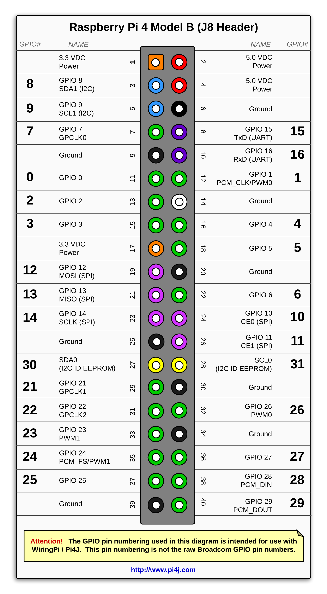
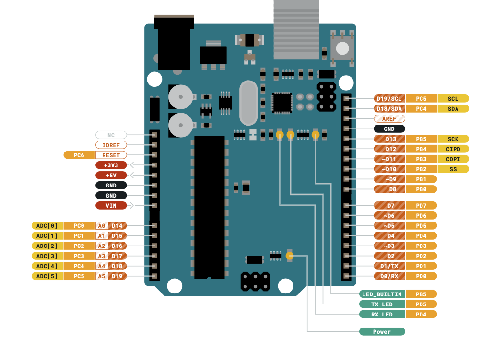

## Synopsis

This is hobby project.

Build a 4 wheeled (4 actuators) chassis with each pair using an H-Bridge motor driver.  An Arduino Uno board and a Raspberry Pi board provide various functionality.  Appendix B lists all components used to build the robot vehicle.

The Arduino Uno board manages all control functions for the robot vehicle.  This includes multi-directional movement and speed control.

The Raspberry Pi hosts a web service to interact through which to interact with and have bidirectional communication with the Arduino board.  The Pi also has a camera attached to it for object detection and facial recognition.  As well, path calculations and speech  are more suited for the Pi.

Communication between the Pi and Arduino is setup using SPI (Serial Peripheral Interface).  It is a synchronous serial communication protocol using a master-slave (Pi-Arduino) Architecture.
## Setup

### VS Code

Use unified VS Code development environment for Arduino and Raspberry Pi.  The plugins required for this are ***Arduino Community Edition*** and ***Remote-SSH***.  

The Arduino is attached to the Mac using a serial connection.  All features from the Arduino IDE, such as code verification, code loading, installing libraries and managing the board connection are supported by the community plugin.

Development on the Pi is managed using the Remote-SSH plugin.

This makes development a more refined experience without having to switch between IDEs/editors, having a consistent way to interact with git and not having to start separate terminals outside the IDE.

## Appendix A Pin Layouts
### Raspberry Pi 4B Pin Layout

### Arduino Uno 3 Pin Layout

## Appendix B Components List
